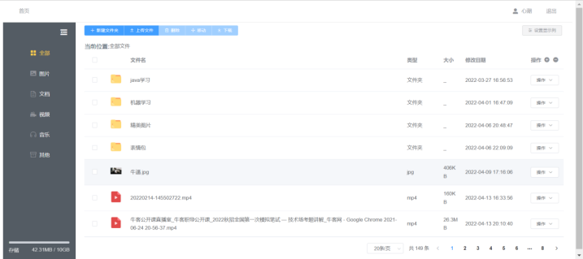
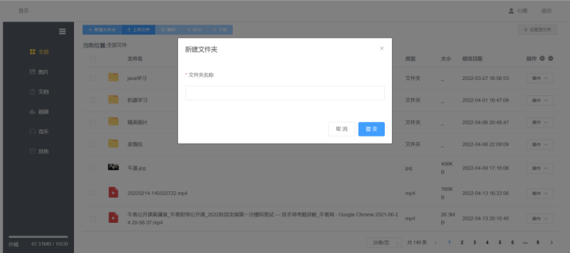
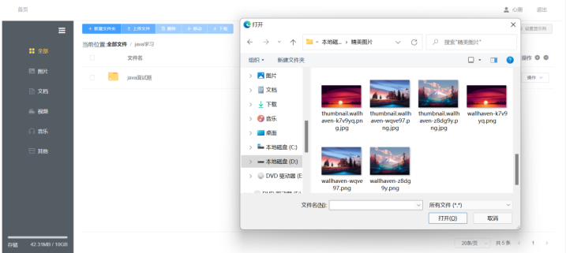
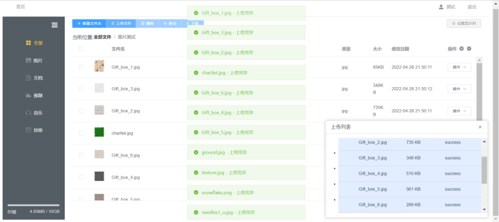
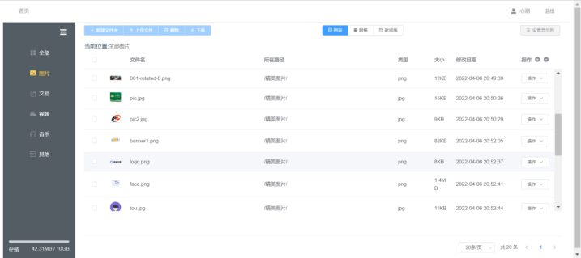
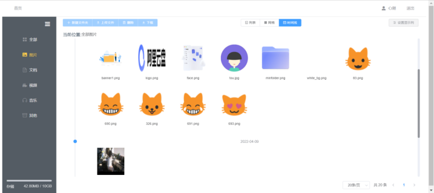
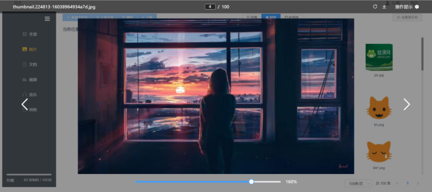
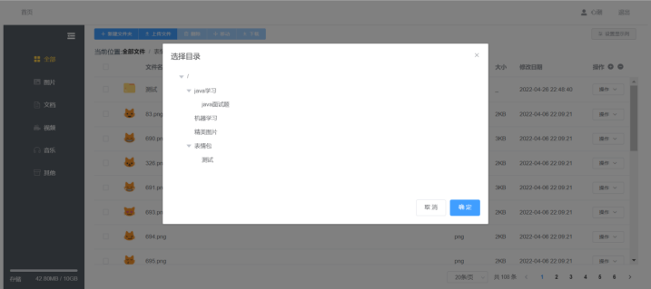
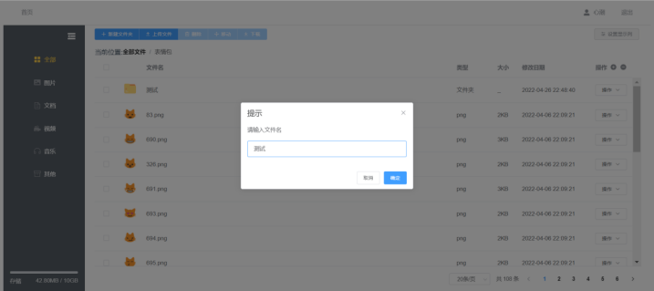

# cloudDisk-web-奇思妙想

#### 介绍
本系统的需求说明书是为了从宏观角度调查分析本系统面对的问题，尽最大努力明确地理解需求，并完整的解决这些需求。它也是一个软件建模的过程，为后期软件设计和编码打下基础，同时需求规格说明又是软件设计、实现、测试直至维护的主要基础。在整个个人云网盘系统中，主要包含下列功能：文件上传、文件下载、文件删除、文件移动、文件重命名、新建文件夹、文件预览以及文件搜索等。最高程度的方便用户对文件的操作，真正实现满足用户多样性的需求，存储用户资料的目的。

#### 软件架构
环境：mysql8、maven3.6、redis6、Java8、Node14.5
后端技术：SpringBoot、MyBatis、MyBatisPlus
设计模式：工厂模式
前端技术：Vue2、Element-UI、axios等等

#### 系统功能
###### 用户模块
> 注册

> 登录

###### 首页
> 文件盘

> 新建文件夹

> 选择文件上传

> 文件上传任务显示

> 图片查看

> 文件移动

> 文件重命名

#### 特技
1.  使用 Readme\_XXX.md 来支持不同的语言，例如 Readme\_en.md, Readme\_zh.md
2.  Gitee 官方博客 [blog.gitee.com](https://blog.gitee.com)
3.  你可以 [https://gitee.com/explore](https://gitee.com/explore) 这个地址来了解 Gitee 上的优秀开源项目
4.  [GVP](https://gitee.com/gvp) 全称是 Gitee 最有价值开源项目，是综合评定出的优秀开源项目
5.  Gitee 官方提供的使用手册 [https://gitee.com/help](https://gitee.com/help)
6.  Gitee 封面人物是一档用来展示 Gitee 会员风采的栏目 [https://gitee.com/gitee-stars/](https://gitee.com/gitee-stars/)
